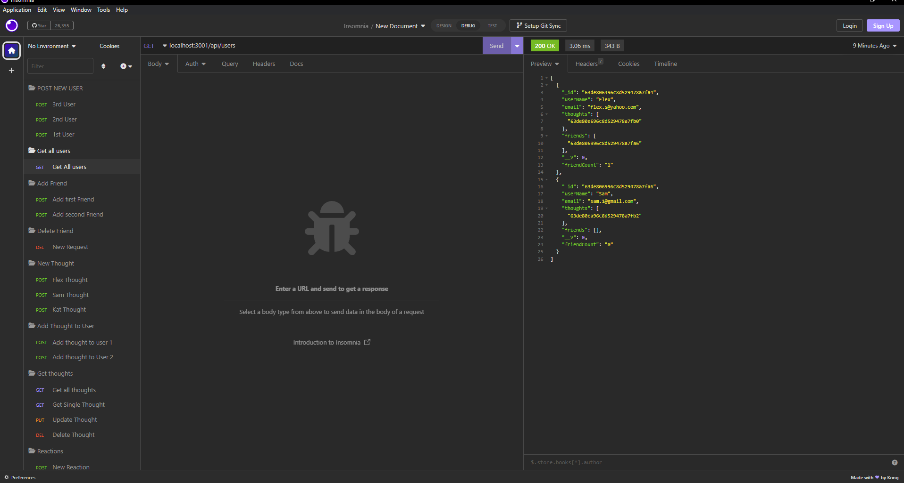
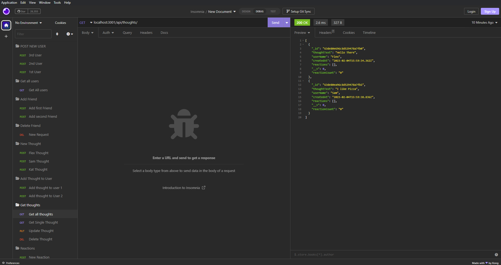
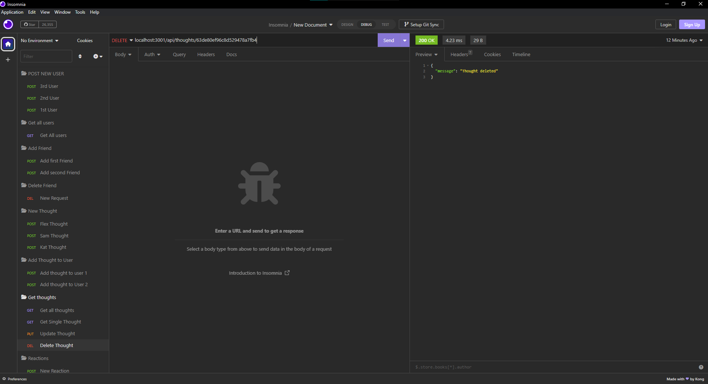

# Social-Network-API
Module 18 challenge

## Description
* This project demonstrates a simple api that mocks the use of a social network.
* You can create a user, add friends, make thought posts, and others can post reactions to that thought. Users, thoughts, and reactions can be edited and deleted.

## Links
* GitHub: https://github.com/IRiceKrispie/Social-Network-API
* Walkthrough: https://youtu.be/tOgTyzBIzm4

## Screenshots

